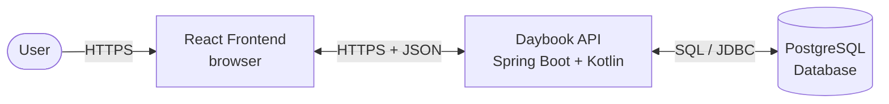
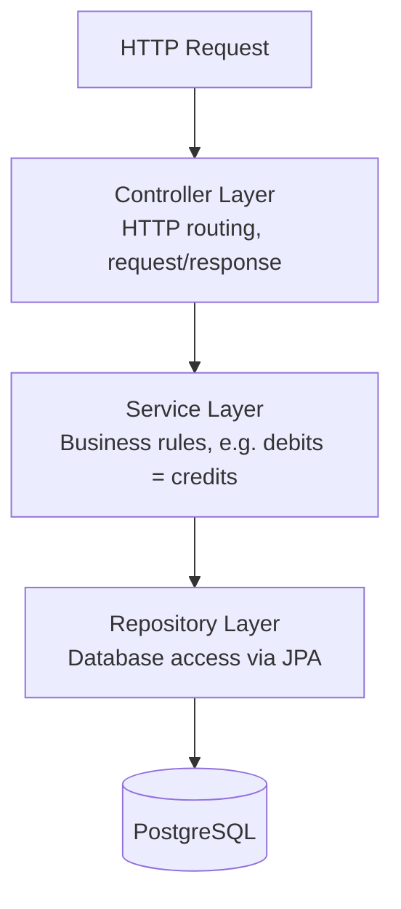
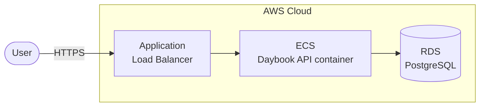

# Daybook — Architecture Overview

This document describes the architecture of Daybook, a double-entry
bookkeeping REST API. It is intended as a living reference — updated
whenever the architecture changes.

## System Architecture

Daybook consists of three main components: a React frontend, a Spring Boot
backend API, and a PostgreSQL database. The frontend communicates with the
API over HTTPS using JSON; the API communicates with the database over
SQL via JDBC.

## Layered Architecture (inside the API)

Within the API, responsibilities are separated into four layers. Each layer
only talks to the layer directly below it.

### Layer Responsibilities

| Layer | Responsibility | Does NOT know about |
|---|---|---|
| Controller | Translates HTTP ↔ Kotlin objects; handles routes and status codes | Databases, business rules |
| Service | Enforces business rules (e.g., double-entry validation) | HTTP, SQL |
| Repository | Reads/writes data to/from PostgreSQL | HTTP, business rules |
| Database | Stores and retrieves data | Anything above |

### Why layered?

1. **Testability** — business rules can be unit-tested without spinning up
   a database or web server
2. **Changeability** — swapping PostgreSQL for another database only
   requires changes in the Repository layer
3. **Clarity** — bugs can be traced to a specific layer based on what
   went wrong

## Deployment (planned — Month 3)

Infrastructure will be defined in Terraform and deployed to AWS. The API
will run on ECS (Elastic Container Service) in a Docker container, and
the database will be managed by RDS (Relational Database Service).

